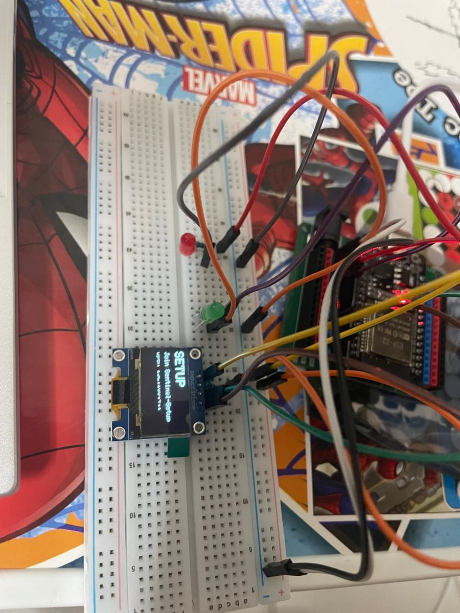
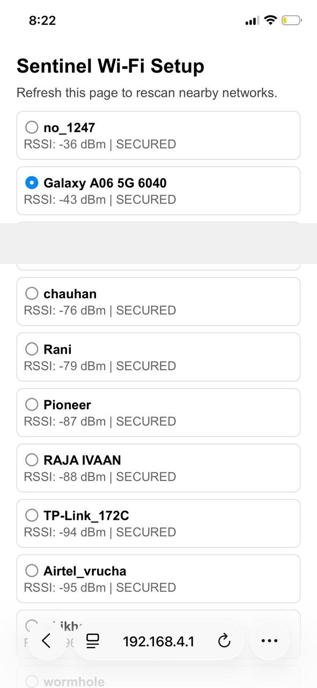
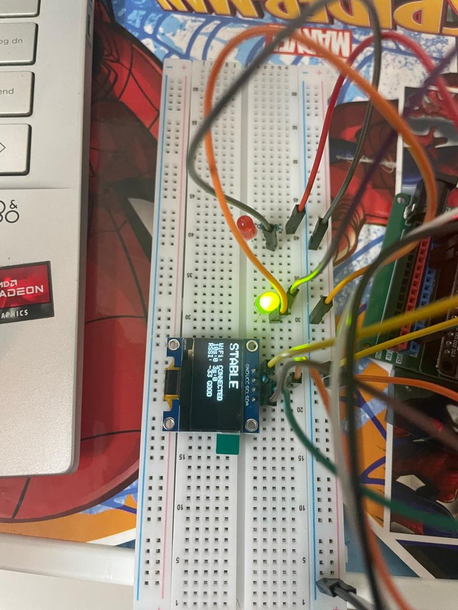
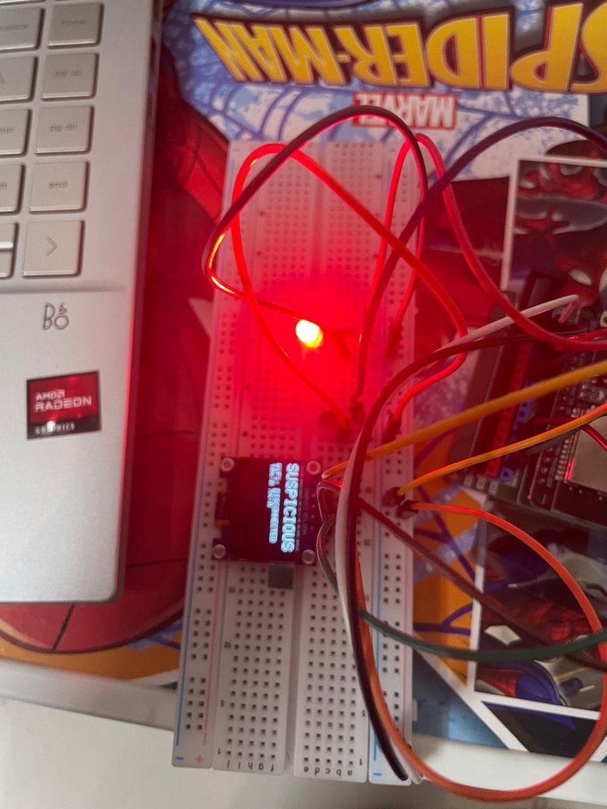
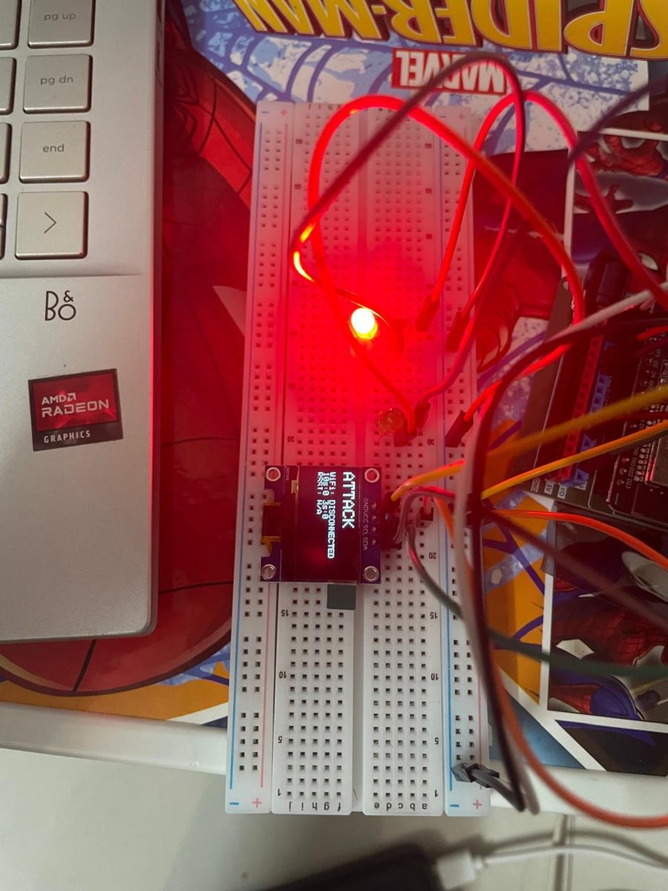
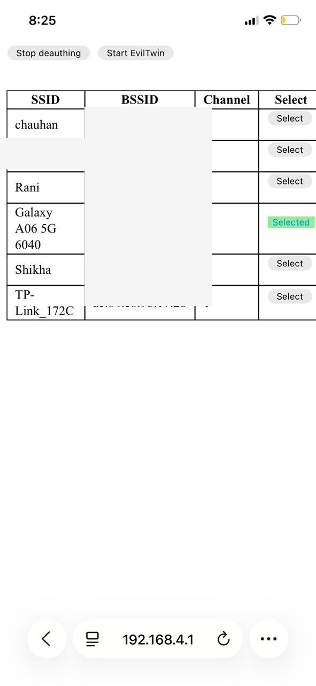

# Sentinel — ESP32 Wi-Fi Disruption Monitor

## The problem with standard deauth detectors

Most deauth detectors inspect 802.11 management frames directly.
In high-traffic environments this generates false positives —
legitimate disconnects are indistinguishable from attack frames
at the frame level.

## What Sentinel does differently

Sentinel monitors **behavioral signatures** instead:
- Disconnect frequency across dual time windows (3s burst, 10s sustained)
- Failed reconnect counts against a known SSID
- RSSI used as context only — not as a trigger

This approach is more reliable in dense 802.11 environments where
frame-level detection breaks down.

## States

| State | LED | Meaning |
|-------|-----|---------|
| NO_WIFI | Green blinking | Not connected |
| STABLE | Green solid | Connected, clean |
| SUSPICIOUS | Red blinking | Anomalous disconnect pattern |
| ATTACK | Red solid | Active disruption detected |

Threat hold timers prevent false recovery — SUSPICIOUS holds
for 5s, ATTACK holds for 8s after last event.

## Setup

1. Power on — device broadcasts `Sentinel-Setup` AP
2. Connect your phone to `Sentinel-Setup`
3. Open `192.168.4.1` in browser
4. Select your SSID and enter password
5. Device enters monitor mode — credentials stay in RAM only, never written to flash

## Hardware

- ESP32 + SSD1306 OLED (I2C)
- Red LED (GPIO 2) + Green LED (GPIO 4)
- Runs on USB power bank — fully portable

## Demo

The demo was run using a companion ESP8266 deauther as the
attacker, targeting the monitored SSID. Sentinel escalates
from STABLE → SUSPICIOUS → ATTACK as the burst window fills,
then holds the ATTACK state through the cooldown period.

### Setup mode

### Setup portal (192.168.4.1)

### Stable — connected, clean

### Suspicious — anomalous pattern detected

### Attack — active disruption

### Attacker side — ESP8266 deauther UI

## Dependencies

- Adafruit SSD1306
- Adafruit GFX
- ESP32 Arduino core

## Note

Built to demonstrate that the deauth threat IDS literature
models is physically detectable on $10 hardware — and that
behavioral detection outperforms frame inspection in real
environments. Related to [TAD-IDS](https://github.com/heraclitus0/TAD-IDS)
research on evaluation methodology in network intrusion detection.
